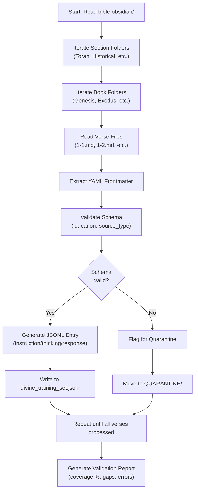

# Folder Structure & Naming Conventions

This document defines the authoritative directory organization for all verse files in `bible-obsidian`. Consistency here ensures the JSONL Forge can traverse the vault deterministically and enables rapid scaling from 1 verse (current) to 86,706+ verses (full canon).

---

## Organizational Philosophy

**Principle:** Organize by **Book** → **File per Verse** (not by chapter subdivisions).

**Rationale:**
- Flat, predictable structure (easier for the Forge to parse)
- Scalable (no subdirectory explosion at chapter level)
- Git-friendly (fine-grained versioning per verse)
- Query-efficient (Obsidian search, Forge filtering)

---

## Directory Tree (Complete Structure)

```mermaid
graph TD
    A["bible-obsidian (root)"] --> B[".obsidian<br/>(Vault config)"]
    A --> C["00_META"]
    A --> D["00_Schema.md"]
    A --> E["CANON_INVENTORY.md"]
    A --> F["FOLDER_STRUCTURE.md<br/>(this file)"]
    A --> G["COVERAGE_TRACKING.md"]
    A --> H["Torah<br/>(5 books)"]
    A --> I["Historical<br/>(12 books)"]
    A --> J["Poetic<br/>(5 books)"]
    A --> K["Prophets<br/>(17 books)"]
    A --> L["Deuterocanonical<br/>(15 books)"]
    A --> M["NewTestament<br/>(27 books)"]
    A --> N["EthiopicApocrypha<br/>(10 books)"]
    A --> O["AdditionalOrthodox<br/>(8 books)"]
    
    H --> H1["Genesis"]
    H --> H2["Exodus"]
    H --> H3["Leviticus"]
    H --> H4["Numbers"]
    H --> H5["Deuteronomy"]
    
    H1 --> H1a["1-1.md<br/>GEN-1-1"]
    H1 --> H1b["1-2.md<br/>GEN-1-2"]
    H1 --> H1c["..."]
    H1 --> H1d["50-26.md<br/>GEN-50-26"]
    
    K --> K1["Isaiah"]
    K --> K2["Jeremiah"]
    K --> K3["..."]
    
    M --> M1["Matthew"]
    M --> M2["Mark"]
    M --> M3["Luke"]
    M --> M4["John"]
    M --> M5["Acts"]
    
    N --> N1["1Enoch"]
    N1 --> N1a["1-1.md<br/>1ENOCH-1-1"]
    N1 --> N1b["1-2.md<br/>1ENOCH-1-2"]
    
    style A fill:#f0f0f0
    style B fill:#e8e8e8
    style C fill:#e8e8e8
    style H1 fill:#fff4e6
    style H1a fill:#fffaef
    style N1a fill:#fff4e6
```



---

## Section-Level Directories

Each of the 9 canon sections gets a **top-level folder**:

### Section Folders

| Folder | Books | Naming | Notes |
|--------|-------|--------|-------|
| `Torah` | Genesis, Exodus, Leviticus, Numbers, Deuteronomy | `[BookName]/` | 5 books |
| `Historical` | Joshua through Esther | `[BookName]/` | 12 books |
| `Poetic` | Job, Psalms, Proverbs, Ecclesiastes, Song of Songs | `[BookName]/` | 5 books |
| `Prophets` | Isaiah through Malachi (Major & Minor) | `[BookName]/` | 17 books |
| `Deuterocanonical` | Tobit through 3 Maccabees | `[BookName]/` | 15 books |
| `NewTestament` | Matthew through Revelation | `[BookName]/` | 27 books |
| `EthiopicApocrypha` | 1 Enoch through Didascalia | `[BookName]/` | 10 books |
| `AdditionalOrthodox` | Misaq through Hymnal | `[BookName]/` | 8 books |

---

## Book-Level Directories

Within each section folder, create **one directory per book**:

### Naming Rules for Book Folders

- **Use Full English Name** (no abbreviations at folder level)
- **Example directories:**
  - `Genesis/` → contains Genesis 1:1, Genesis 1:2, ..., Genesis 50:26
  - `1Enoch/` → contains 1 Enoch 1:1, 1 Enoch 1:2, ..., 1 Enoch 108:X
  - `SongOfSongs/` → contains Song of Songs verses
  - `1Corinthians/` → contains 1 Corinthians verses

### Special Cases

| Book | Folder Name | Rationale |
|------|-------------|-----------|
| 1 Enoch | `1Enoch/` | No spaces; "1" prefix to distinguish from "Enoch" (if separate) |
| 2 Enoch | `2Enoch/` | — |
| 1 Maccabees | `1Maccabees/` | — |
| Song of Songs | `SongOfSongs/` | No slashes; PascalCase |
| Prayer of Manasseh | `PrayerOfManasseh/` | Descriptive name preserved |
| Psalms of Solomon | `PsalmsOfSolomon/` | — |
| Testament of Isaac & Jacob | `TestamentOfIsaacAndJacob/` | Single unified folder (see note below) |

---

## Verse-Level Files

Inside each book folder, create **one `.md` file per verse** named as `[CHAPTER]-[VERSE].md`:

### File Naming Convention

```
[CHAPTER]-[VERSE].md
```

**Examples:**
- `1-1.md` → Chapter 1, Verse 1
- `1-2.md` → Chapter 1, Verse 2
- `10-15.md` → Chapter 10, Verse 15
- `151-1.md` → Psalm 151, Verse 1 (for Psalm 151)

### File Naming Edge Cases

| Scenario | Format | Example |
|----------|--------|---------|
| Multi-verse sections (rare) | `[CHAPTER]-[START_VERSE]-[END_VERSE].md` | `3-16-17.md` (if verses 16-17 must be unified) |
| Psalm with multiple sections | Keep separate files | `1-1.md`, `1-2.md`, etc. |
| Prayer of Manasseh (single prayer, no chapters) | `1-1.md` through `1-X.md` | Single "chapter" (numbered as 1) |
| Testament texts (may have unnumbered sections) | Use sequential numbering | `1-1.md`, `1-2.md`, etc. |
| Hymnal excerpts (liturgical verses) | `[HYMN_NUM]-[LINE].md` | `1-1.md` (Hymn 1, line 1) |

---

## Complete Directory Example: Genesis

```
Genesis/
├── 1-1.md          (ID: GEN-1-1)
├── 1-2.md          (ID: GEN-1-2)
├── 1-3.md          (ID: GEN-1-3)
├── ...
├── 1-31.md         (ID: GEN-1-31)
├── 2-1.md          (ID: GEN-2-1)
├── 2-2.md          (ID: GEN-2-2)
├── ...
├── 50-25.md        (ID: GEN-50-25)
└── 50-26.md        (ID: GEN-50-26)
```

**Total files in Genesis: 1,533 verse files**

---

## Complete Directory Example: 1 Enoch

```
EthiopicApocrypha/
└── 1Enoch/
    ├── 1-1.md          (ID: 1ENOCH-1-1)
    ├── 1-2.md          (ID: 1ENOCH-1-2)
    ├── 1-3.md          (ID: 1ENOCH-1-3)
    ├── ...
    ├── 1-9.md          (ID: 1ENOCH-1-9)
    ├── 2-1.md          (ID: 1ENOCH-2-1)
    ├── ...
    ├── 108-1.md        (ID: 1ENOCH-108-1)
    └── 108-X.md        (ID: 1ENOCH-108-X)
```

**Total files in 1 Enoch: ~2,080 verse files**

---

## Complete Directory Example: New Testament (Matthew)

```
NewTestament/
└── Matthew/
    ├── 1-1.md          (ID: MAT-1-1)
    ├── 1-2.md          (ID: MAT-1-2)
    ├── ...
    ├── 1-25.md         (ID: MAT-1-25)
    ├── 2-1.md          (ID: MAT-2-1)
    ├── ...
    ├── 28-19.md        (ID: MAT-28-19)
    └── 28-20.md        (ID: MAT-28-20)
```

**Total files in Matthew: 1,071 verse files**

---

## Full Vault Structure (Summary)

```
bible-obsidian/
├── .obsidian/
├── 00_META/
│   ├── Divine_Manifesto.md
│   └── [other meta files]
├── 00_Schema.md
├── CANON_INVENTORY.md
├── FOLDER_STRUCTURE.md (this file)
├── COVERAGE_TRACKING.md
├── DATA_VALIDATION_RULES.md (future)
├── Torah/
│   ├── Genesis/
│   ├── Exodus/
│   ├── Leviticus/
│   ├── Numbers/
│   └── Deuteronomy/
├── Historical/
│   ├── Joshua/
│   ├── Judges/
│   ├── Ruth/
│   ├── 1Samuel/
│   ├── 2Samuel/
│   ├── 1Kings/
│   ├── 2Kings/
│   ├── 1Chronicles/
│   ├── 2Chronicles/
│   ├── Ezra/
│   ├── Nehemiah/
│   └── Esther/
├── Poetic/
│   ├── Job/
│   ├── Psalms/
│   ├── Proverbs/
│   ├── Ecclesiastes/
│   └── SongOfSongs/
├── Prophets/
│   ├── Isaiah/
│   ├── Jeremiah/
│   ├── Lamentations/
│   ├── Ezekiel/
│   ├── Daniel/
│   ├── Hosea/
│   ├── Joel/
│   ├── Amos/
│   ├── Obadiah/
│   ├── Jonah/
│   ├── Micah/
│   ├── Nahum/
│   ├── Habakkuk/
│   ├── Zephaniah/
│   ├── Haggai/
│   ├── Zechariah/
│   └── Malachi/
├── Deuterocanonical/
│   ├── Tobit/
│   ├── Judith/
│   ├── 1Maccabees/
│   ├── 2Maccabees/
│   ├── WisdomOfSolomon/
│   ├── Sirach/
│   ├── BelAndTheDragon/
│   ├── 1Esdras/
│   ├── 2Esdras/
│   ├── Baruch/
│   ├── PrayerOfManasseh/
│   ├── Odes/
│   ├── LetterToTheLaodiceans/
│   └── 3Maccabees/
├── NewTestament/
│   ├── Matthew/
│   ├── Mark/
│   ├── Luke/
│   ├── John/
│   ├── Acts/
│   ├── Romans/
│   ├── 1Corinthians/
│   ├── 2Corinthians/
│   ├── Galatians/
│   ├── Ephesians/
│   ├── Philippians/
│   ├── Colossians/
│   ├── 1Thessalonians/
│   ├── 2Thessalonians/
│   ├── 1Timothy/
│   ├── 2Timothy/
│   ├── Titus/
│   ├── Philemon/
│   ├── Hebrews/
│   ├── James/
│   ├── 1Peter/
│   ├── 2Peter/
│   ├── 1John/
│   ├── 2John/
│   ├── 3John/
│   ├── Jude/
│   └── Revelation/
├── EthiopicApocrypha/
│   ├── 1Enoch/
│   ├── 2Enoch/
│   ├── Jubilees/
│   ├── PsalmsOfSolomon/
│   ├── 4Ezra/
│   ├── ApocalypseOfJames/
│   ├── ApostolicConstition/
│   ├── SynaxarionNarrative/
│   ├── KebraaNagast/
│   └── Didascalia/
├── AdditionalOrthodox/
│   ├── Misaq/
│   ├── TestamentOfAbraham/
│   ├── TestamentOfIsaacAndJacob/
│   ├── EthiopianActa/
│   ├── Salalae/
│   ├── MiraclesOfJesus/
│   ├── LivesOfSaints/
│   └── Hymnal/
└── [QUARANTINE/ - optional, for schema violations]
```

---

## JSONL Forge Directory Traversal

The Forge script (`scripts/jsonl-forge.ts`) traverses this structure as follows:



---

## Incrementally Populating the Vault

### Phase 1A: Bootstrap (Current)
- ✅ 1 Enoch 1:1 (validation test)
- Folder: `EthiopicApocrypha/1Enoch/1-1.md`

### Phase 1B: Expand to Full 1 Enoch
- Add 1 Enoch 1:2 through 1 Enoch 108:X
- ~2,080 files total
- Folder: `EthiopicApocrypha/1Enoch/`

### Phase 1C: Add Torah (5 books, ~5,852 verses)
- Genesis through Deuteronomy
- Folders: `Torah/Genesis/`, `Torah/Exodus/`, etc.

### Phase 2: Historical + Poetic (17 books, ~12,803 verses)
- Rapid bulk import

### Phase 3+: New Testament & Remaining Sections
- Scale to full 86,706+ verses

---

## File Metadata & Frontmatter

Every verse file uses the **mandatory YAML schema**:

```yaml
---
id: [BOOK-CHAPTER-VERSE]
canon: [e.g., Ethiopian-81, Masoretic]
book: [Full Book Name]
chapter: [Number]
verse: [Number]
source_type: Scripture
---

[Verse text content]
```

**Example: `EthiopicApocrypha/1Enoch/1-1.md`**
```yaml
---
id: 1ENOCH-1-1
canon: Ethiopian-81
book: 1 Enoch
chapter: 1
verse: 1
source_type: Scripture
---

The word of the blessing of Enoch, how he blessed the elect and the righteous, who were to exist in the time of trouble; rejecting all the wicked and ungodly.
```

---

## Git & Version Control

### `.gitignore` Strategy

Add to the vault's `.gitignore` (or root `.gitignore`):

```
# Avoid committing generated files
divine_training_set.jsonl
*.bak
.DS_Store

# Obsidian caches
.obsidian/cache/

# Optional: Exclude test/staging files
QUARANTINE/
```

### Commit Practices

- **Atomic commits**: One book section per commit (e.g., "Add Genesis 1-50")
- **Commit message**: `feat(bible-obsidian): Add Genesis (1,533 verses) [GEN-1-1 to GEN-50-26]`
- **Bulk imports**: Tag commits with phase/milestone

---

## Publishing & External Access

If `bible-obsidian` is exported to static documentation (e.g., **docs.jexxx.us**), the folder structure translates directly to URL paths:

```
docs.jexxx.us/scriptures/torah/genesis/1-1/
docs.jexxx.us/scriptures/prophets/isaiah/1-1/
docs.jexxx.us/scriptures/ethiopic-apocrypha/1-enoch/1-1/
```

---

## Related Documentation

- [CANON_INVENTORY.md](CANON_INVENTORY.md) – Complete book inventory (99 books, 86,706 verses)
- [00_Schema.md](00_Schema.md) – Mandatory YAML frontmatter structure
- [COVERAGE_TRACKING.md](COVERAGE_TRACKING.md) – Live progress dashboard
- [DATA_VALIDATION_RULES.md](DATA_VALIDATION_RULES.md) – Quality assurance checklist

---

## Summary Table

| Aspect | Value |
|--------|-------|
| **Total Sections** | 9 |
| **Total Books** | 99 |
| **Total Verses** | 86,706 |
| **File Structure** | Section → Book → Verse |
| **Verse File Naming** | `[CHAPTER]-[VERSE].md` |
| **ID Format** | `[BOOK_ID]-[CHAPTER]-[VERSE]` |
| **Schema** | YAML frontmatter + markdown content |
| **Traversal Pattern** | Deterministic (Forge-compatible) |
